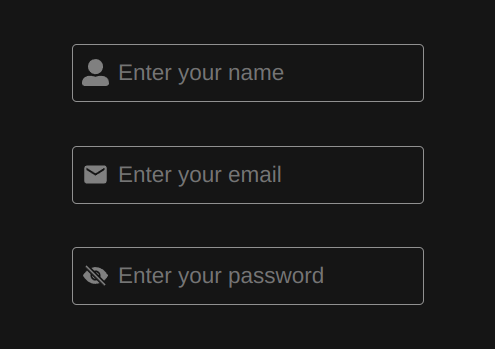

# ICONIQ for ReactJS

🎉 Iconiq simplifies React with easy props for styled inputs, customizable icons, compatible with dark/light themes. Plus, it reduces your code length and lets you create form groups effortlessly!

# Installation

```
$ npm install iconiq

```

# Features

- Simplified Usage: Easily create styled input fields with minimal props required!
- Pre-Structured Icons: Choose from a variety of pre-designed icons that can be easily customized by passing a single "type" prop.
- Pre-built Button component: Comes with pre-built button <IcoButton>Click</IcoButton>!
- Reduced Code Length: Light React-based library that minimizes the amount of code needed.
- Customization Flexibility: Users can effortlessly apply their own customizations.
- Form Group Creation: Instantly generate form groups by simply adding a single <IcoFormControl> tag, enhancing efficiency and reducing development time.

# This is how you would write input fields in forms:

```jsx
function App() {
  const [name, setName] = useState("")

  return (
    <input
      type={"text"}
      value={name}
      setValue={(e) => setName(e.target.value)}
      className="inputField"
      placeholder="Enter your name"
    />
  );
}
```

We haven't added any fancy styling icons yet. And dealing with CSS? That's just gonna add more lines of code.
But hey, why not try out Iconiq instead?

```jsx
import React from "react";
import { IcoInput } from "iconiq";

function App() {
  const [name, setName] = useState("")
  
  return (
    <IcoInput
      type="name"
      value={name}
      setValue={(e) => setName(e.target.value)}
    />
  );
}
```

That's it! You got your input. All the placeholders, icons and stylings are already added into it!
What about the theme? The CSS styling is super minimalistic, so it blends seamlessly with any theme you've got going on.



<br/>

# Let's compare the code length while creating a complete login form.

Without Iconiq

```jsx
import React, { useState } from "react";

function LoginForm() {
  const [formData, setFormData] = useState({
    name: "",
    email: "",
    password: "",
  });

  const handleChange = (e) => {
    const { name, value } = e.target;
    setFormData((prevState) => ({
      ...prevState,
      [name]: value,
    }));
  };

  const handleSubmit = (e) => {
    e.preventDefault();
    // Handle form submission logic here
    console.log(formData);
  };

  return (
    <form onSubmit={handleSubmit}>
      <div>
        <label>
          Name:
          <input
            type="text"
            name="name"
            value={formData.name}
            onChange={handleChange}
          />
        </label>
      </div>
      <div>
        <label>
          Email:
          <input
            type="email"
            name="email"
            value={formData.email}
            onChange={handleChange}
          />
        </label>
      </div>
      <div>
        <label>
          Password:
          <input
            type="password"
            name="password"
            value={formData.password}
            onChange={handleChange}
          />
        </label>
      </div>
      <button type="submit">Login</button>
    </form>
  );
}

export default LoginForm;
```

Now with Iconiq!


```jsx
import React from "react";
import { IcoInput, IcoFormControl } from "iconiq";

function App() {

  const [formData, setFormData] = useState({ name: "", email: "", password: "" });

  const handleChange = (e) => {
    const { name, value } = e.target;
    setFormData((prevState) => ({
      ...prevState,
      [name]: value,
    }));
  };

  const handleSubmit = (e) => {
    e.preventDefault();
  };
  return (
    <IcoFormControl entries={[
        { type: "name", value: { name }, onChange: (e) => setName(e.target.value) },
        { type: "email", value: { email }, onChange: (e) => setEmail(e.target.value) },
        { type: "password",value: { password }, onChange: (e) => setPassword(e.target.value) },
      ]}
    />
  );
}
```

That's it! See how simple it was? Try it on your local pc.


# Other props...

```jsx
<IcoInput type="name"/>
<IcoInput type="email"/>
<IcoInput type="password"/>
<IcoInput type="phone"/>
<IcoInput type="dob"/>
<IcoInput type="url"/>
<IcoInput type="linkedin"/>
<IcoInput type="github"/>
<IcoInput type="medium"/>
<IcoInput type="twitter"/>
```

### Note: You can also pass any other properties just like you would with a regular input field.

#### If you have any suggestions, don't hesitate to contact me.

- Email: rohanpandey749@gmail.com
- Github: [Link](https://github.com/rohan749)
- LinkedIn: [Link](https://www.linkedin.com/in/rohan20231/)
- Twitter: [Link](https://twitter.com/heyrohan7)
- Instagram: [Link](https://www.instagram.com/_r.code_/)